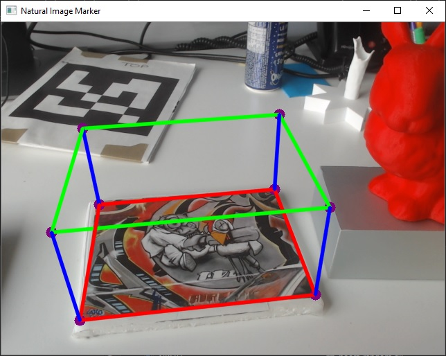
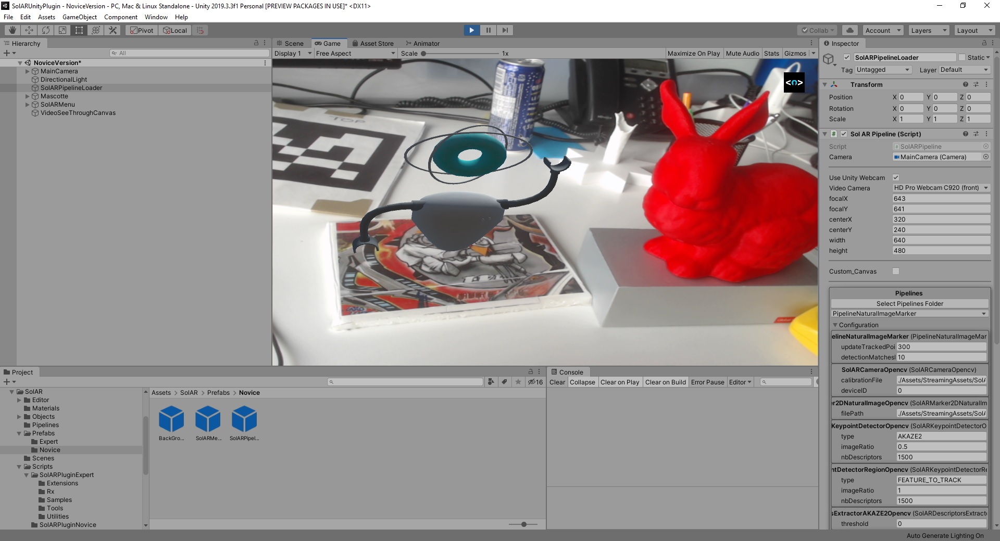

# DEPRECATED - This repo is no longer maintained

----

# SolAR Natural Image Marker

The SolAR **Natural Image Marker sample** show a SolAR pipeline for augmented reality based on a natural image.
 
This pipeline loads a reference image marker, then tries to detect it on real-time camera images and to estimate the pose of the camera in relation to the coordinate system of the image marker. If the marker is detected, the pipeline over the current camera image renders a 3D cube from a virtual camera which pose corresponds to the one estimated by the pipeline.

|  |  |
|:-:|:-:|
| SolARPipelineTest_NaturalImageMarker | SolARPipeline_NaturalImageMarker | 

## How to run

* To run it, first print the marker [graf1.png](./SolARPipeline_NaturalImageMarker/tests/SolARPipelineTest_NaturalImageMarker/graf1.png).

* If you want to change your natural image, you can edit the [grafMarker.yml](./SolARPipeline_NaturalImageMarker/tests/SolARPipelineTest_NaturalImageMarker/grafMarker.yml).

* If you want to change the calibration parameters of the camera, edit the [camera_calibration.json](./SolARPipeline_NaturalImageMarker/tests/SolARPipelineTest_NaturalImageMarker/camera_calibration.json).

* To change properties of the components of the natural pipeline, edit the [conf_NaturalImageMarker.xml](./SolARPipeline_NaturalImageMarker/tests/SolARPipelineTest_NaturalImageMarker/SolARPipelineTest_NaturalImageMarker_conf.xml) file.

If you want to run your Natural image samples after having built them, do not forget to install the required dependencies if not already done:

<pre><code>remaken install packagedependencies.txt</code></pre>

and for debug mode:

<pre><code>remaken install packagedependencies.txt -c debug</code></pre>

For more information about how to install remaken on your machine, visit the [install page](https://solarframework.github.io/install/) on the SolAR website.

 ### SolARPipelineTest_NaturalImageMarker

Open a terminal in the `bin/Release` or `bin/Debug`folder and execute :

> #### Windows
>
	SolARPipelineTest_NaturalImageMarker.exe

> #### Linux
>
	./run.sh ./SolARPipelineTest_NaturalImageMarker   

*  When the application is started, point the camera to the natural image marker (you can see a virtual cube on the marker). 
* Press `escape` to quit the application.

### Plugin

You should have bundle every required library in your Unity project (`./Assets/Plugins`). Then from Unity Gameobject *PipelineLoader* you can load your configuration file for the natural image pipeline. You can directly edit parameters from Unity Editor's inspector.

## Contact 
Website https://solarframework.github.io/

Contact framework.solar@b-com.com

